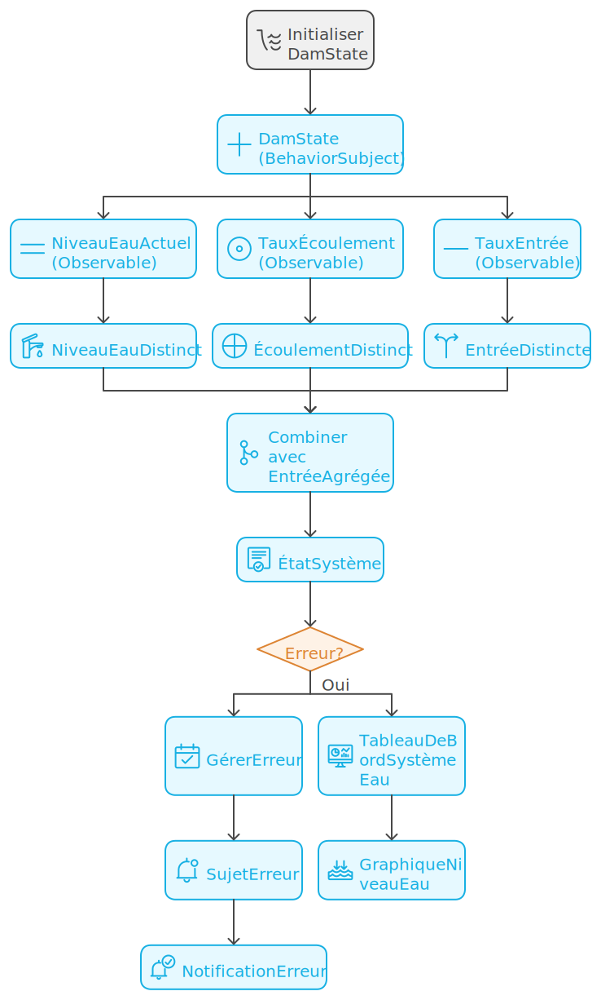

# Vue Water System Boilerplate

Ce projet est un boilerplate pour un système de gestion d'eau utilisant Vue.js avec TypeScript. Il fournit une structure de base robuste et modulaire pour développer des applications de surveillance et de contrôle de systèmes hydrauliques.

## Table des matières

- [Vue Water System Boilerplate](#vue-water-system-boilerplate)
  - [Table des matières](#table-des-matières)
  - [Architecture](#architecture)
  - [Fonctionnalités](#fonctionnalités)
  - [Technologies utilisées](#technologies-utilisées)
  - [Prérequis](#prérequis)
  - [Installation](#installation)
  - [Développement](#développement)
    - [Scripts utiles](#scripts-utiles)
  - [Structure du projet](#structure-du-projet)
  - [Composants principaux](#composants-principaux)
  - [Tests](#tests)
  - [Contribution](#contribution)
  - [Licence](#licence)

## Architecture

L'architecture du projet est représentée par le diagramme suivant :


Ce diagramme illustre les relations entre les différents composants, services et utilitaires du projet.


Architecture RxJS


2 schémas résumant les flux d'observables et de sujets :

[](docs/schema-dam.svg)

[](docs/schema-dam-graph.svg)


Schéma en code Mermaid


## Fonctionnalités

- **Simulation de barrage** : Gestion dynamique des niveaux d'eau et des débits
- **Tableau de bord interactif** : Visualisation en temps réel des données du système hydraulique
- **Gestion des erreurs centralisée** : Capture et traitement unifié des erreurs à travers l'application
- **Journalisation des événements** : Enregistrement détaillé des activités du système
- **Tests unitaires et d'intégration** : Assurance qualité et fiabilité du code

## Technologies utilisées

- **Vue.js 3** : Framework JavaScript progressif pour la construction d'interfaces utilisateur
- **TypeScript** : Superset typé de JavaScript pour un développement plus robuste
- **RxJS** : Bibliothèque pour la programmation réactive
- **Chart.js** : Bibliothèque de visualisation de données
- **Biome** : Outil de linting et de formatage de code
- **Vitest** : Framework de test unitaire pour Vue.js
- **Docker** : Plateforme de conteneurisation pour le déploiement et l'exécution

## Prérequis

- Docker
- Docker Compose
- Node.js (version 18 ou supérieure)
- pnpm (gestionnaire de paquets)

## Installation

1. Clonez ce dépôt :
   ```bash
   git clone https://github.com/votre-nom/vue-water-system-boilerplate.git mon-projet
   cd mon-projet
   ```

2. Copiez le fichier .env.example en .env et ajustez les variables si nécessaire :
   ```bash
   cp .env.example .env
   ```

3. Construisez et lancez les conteneurs Docker :
   ```bash
   docker-compose -f docker/docker-compose.yml up -d --build
   ```

4. Accédez à l'application sur `http://localhost:3000` (ou le port que vous avez défini)

## Développement

Ce projet utilise Biome pour le linting et le formatage du code, ainsi que Husky et lint-staged pour assurer la qualité du code à chaque commit.

### Scripts utiles

- `pnpm dev` : Démarre le serveur de développement
- `pnpm build` : Construit l'application pour la production
- `pnpm test` : Exécute les tests unitaires
- `pnpm format:check` : Vérifie le formatage du code
- `pnpm format:write` : Formate le code automatiquement
- `pnpm docker:dev` : Lance l'environnement de développement dans Docker

## Structure du projet

```
.
├── docker/                 # Configuration Docker
├── docs/                   # Documentation supplémentaire
├── src/
│   ├── assets/             # Ressources statiques (images, styles)
│   ├── components/         # Composants Vue réutilisables
│   ├── composables/        # Logique réutilisable (hooks)
│   ├── config/             # Fichiers de configuration
│   ├── domain/             # Logique métier et interfaces
│   ├── presentation/       # Composants de présentation (pages)
│   ├── services/           # Services (API, gestion d'erreurs, etc.)
│   ├── types/              # Définitions de types TypeScript
│   └── utils/              # Fonctions utilitaires
├── tests/                  # Tests unitaires et d'intégration
└── README.md               # Ce fichier
```

## Composants principaux

- **WaterSystemDashboard** : Composant principal affichant l'ensemble du système
- **DamComponent** : Représente un barrage individuel avec ses données
- **WaterLevelChart** : Graphique montrant l'évolution du niveau d'eau
- **ErrorNotification** : Affiche les erreurs système à l'utilisateur
- **GlobalErrorHandler** : Gère la capture et l'affichage des erreurs globales

## Tests

Les tests sont écrits avec Vitest et peuvent être exécutés avec la commande `pnpm test`. Ils couvrent :

- Les composants Vue (tests unitaires et de rendu)
- Les composables (logique réutilisable)
- Les services (simulations et gestion des erreurs)

## Contribution

Les contributions sont les bienvenues ! Veuillez consulter le fichier CONTRIBUTING.md pour plus de détails sur notre processus de contribution. En général :

1. Forkez le projet
2. Créez votre branche de fonctionnalité (`git checkout -b feature/AmazingFeature`)
3. Committez vos changements (`git commit -m 'Add some AmazingFeature'`)
4. Poussez vers la branche (`git push origin feature/AmazingFeature`)
5. Ouvrez une Pull Request

## Licence

Ce projet est sous licence MIT. Voir le fichier [LICENSE](LICENSE) pour plus de détails.
